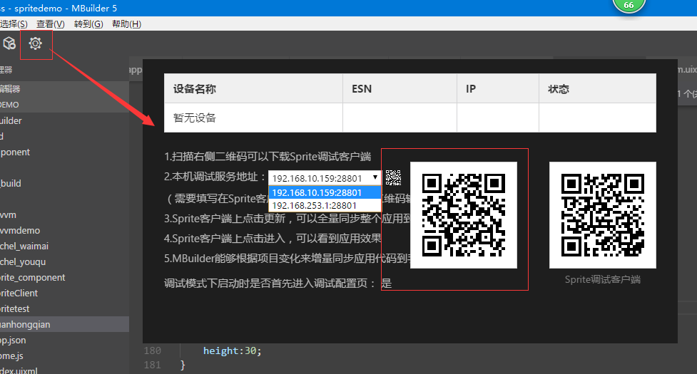
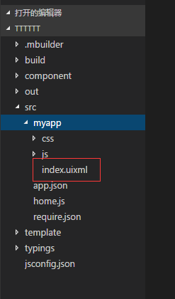
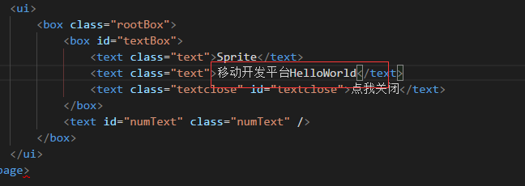
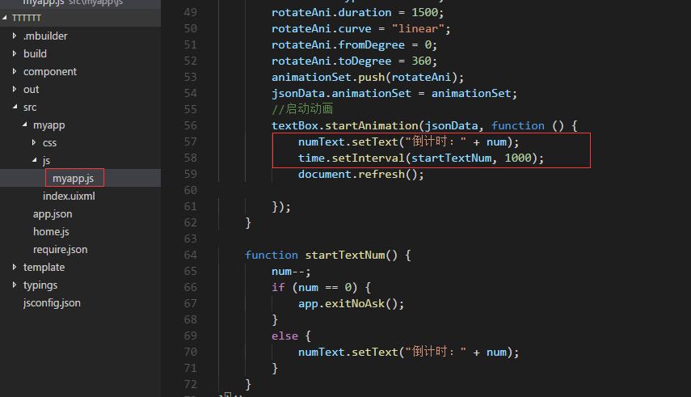
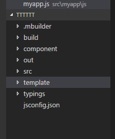

# 从helloworld开始  

----------

<h2 id="cid_0">开发环境搭建</h2>

1.从官网下载Mbuilder5 IDE ,[window版 ](https://www.exmobi.cn/downloadRedirect.jsp?type=mb5_win32)或者 [MAC版](https://www.exmobi.cn/downloadRedirect.jsp?type=mb5_mac)，sprite客户端（[Android端](https://www.exmobi.cn/sprite/sprite-android.apk) 和[ IOS端](https://www.exmobi.cn/sprite/sprite-ios.ipa)）。
  
2.安装Mubilder5，注意安装过程中关闭360等拦截软件。 

3.在手机上安装sprite.apk或者sprite.ipa，注意ios提供的是企业版，可以直接通过手机助手进行安装，安装后需要手动的在“设置-通用-描述文件与设备管理”对应用添加信任。  

开发者也可以扫描Mbuilder提供的二维码进行安装。

  

4.要保证手机和自己的开发电脑在同一个wifi内，并且可以网通。  

<h2 id="cid_1">新建项目</h2>

1.打开mbuilder新建一个sprite项目工程：  

    

注意，在填写项目名称的时候不要用中文。

2.同步代码

手机端安装好app后，打开出现如下界面：

 

扫描或者输入Mbuilder上提供的IP地址和端口：

 

开发调试的时候，必须保证手机和电脑在同一个wifi下面，如果同步不了，可以尝试关闭防火墙。

代码更新成功后，点击“进入”，效果如下：

 

3.修改页面内容

在src目录下，打开myapp/index.uixml页面。

 

修改里面的内容，然后保存，如：

如果手机停留在该页面上，这时候保存会自动同步，下次重新打开该页面即可生效，由于该示例里面有一个定时器，自动关页面，可以调试的时候把定时器代码注释掉。

也可以重新进入应用在调试页面上点击“更新”进行全部更新。

<h2 id="cid_2">应用目录结构</h2>

新建完应用工程后，会看到很多目录，如图：

**.mbuilder** : mbuilder自身配置文件目录，开发者不用太关心。

**build**：应用打包配置目录

**component**：官方组件管理目录，该目录的组件会自动管理，开发者不需要关心

**out** :  构建出的资源目录，改目录的代码基本上从src目录同步过来，是最终同步给手机端的目录

**src**：开发者的代码编辑区目录，开发者只能在该目录下编写自己的代码。

**template**：模板管理目录，开发者新建项目时候选择的模板源码在这个目录下，方法日后查看。

**typings**：代码提示配置文件，开发者不用关心，mbuildr维护。

