# 从helloworld开始  

----------

**示例代码下载**：[helloword.sprite](https://github.com/yuanhongqian/sprite-api/blob/master/src/helloword.sprite")  
xx.sprite文件是sprite工程文件，可以直接通过mbuilder5的导入sprite应用，导入该工程文件，开发者可以通过zip解压该文件，源码在src目录。

<h2 id="cid_0">开发环境搭建</h2>

1.从官网下载Mbuilder5 IDE，sprite客户端（apk和ipa）。
  
2.安装Mubilder5，注意安装过程中关闭360等拦截软件。 

3.在手机上安装sprite.apk或者aprite.ipa，注意ios提供的是企业版，可以直接通过手机助手进行安装，安装后需要手动的在“设置-通用-描述文件与设备管理”对应用添加信任。  

开发者也可以扫描Mbuilder提供的二维码进行安装。
  

4.要保证手机和自己的开发电脑在同一个wifi内，并且可以网通。  


<h2 id="cid_1">新建项目</h2>

1.打开mbuilder新建一个sprite项目工程：  

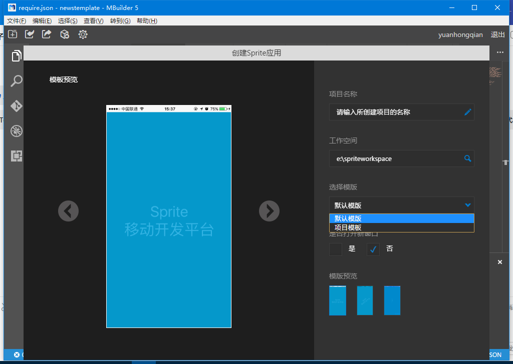    

创建好工程后，会有一些项目中最基础的文件代码，如果app.json

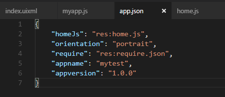   

homeJs:应用的入口js地址，res:前缀是基于apps目录开始；  

orientation:横竖屏设置，portrait:竖屏（默认）、landscape:横屏、device:支持横竖屏切换；  

requrie:配制应用需要的css,js,模板的全局路径。

appversion:应用资源版本号。  

appname:应用名称。  

在手机端第一个页面配置Mbuilder同步工具的IP地址和端口，具体的IP端口信息查看下图所示。 

  

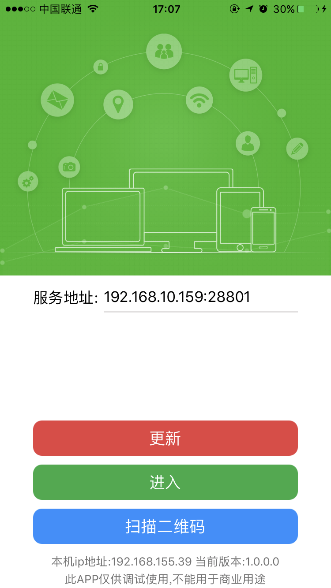   

点更新即可同步代码，如果没有同步也可以把工程目录src目录下的文件及目录手动直接拷贝到手机对应目录里，通过手机助手找到对应目录spirte/apps:  

Ios手机对应目录：  

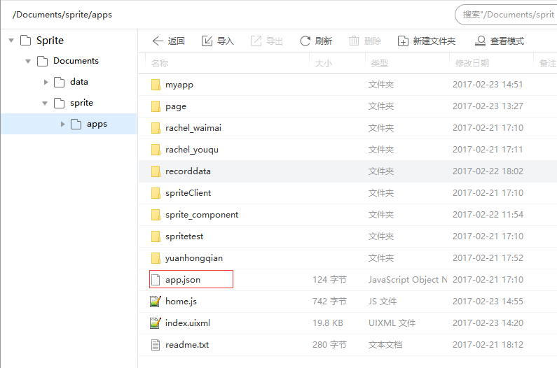     

android手机对应目录：    


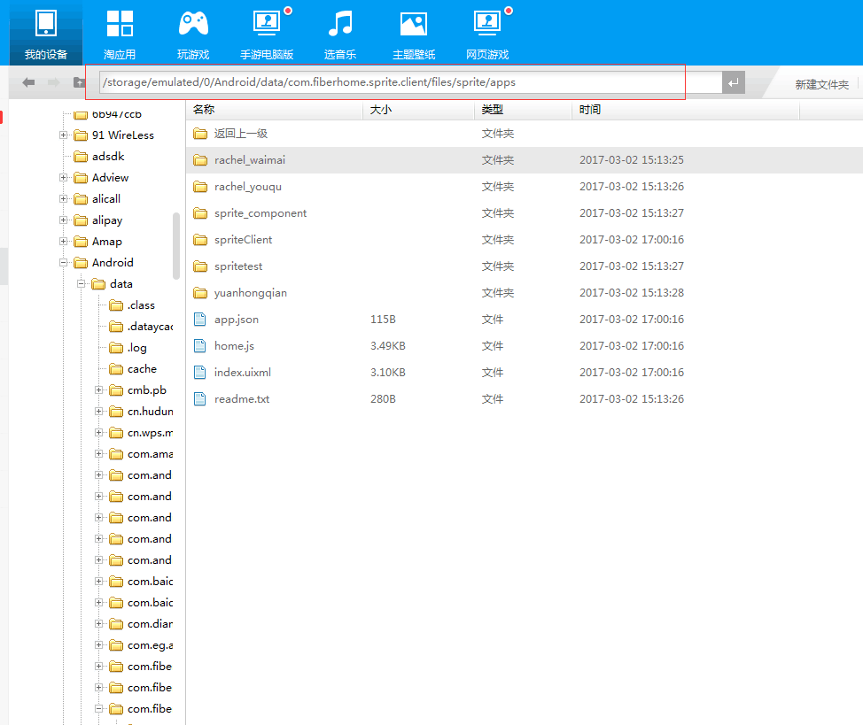    


2.创建require.json文件

该文件里面主要是配置js,css,模板文件引用的全局路径。

```javascrpt

{
    "jsPaths": {
        "myappjs": "res:myapp/js/myapp.js"
    },
    "componentPaths": {},
    "cssPaths": {
        "myappcss": "res:myapp/css/myapp.css"
    }
}

```


3.创建程序入口文件home.js  

该文件名和文件路径和app.json里面指向的保存一致即可，上图示例中home.js文件是直接放在apps根目录下。然后编写home.js里面的内容代码如下：  

```javascript
var app = require("App");
var window = require("Window");

app.on("launch", function (e, jsonData) {

    var type = jsonData.type;
    if (type == "normal") {

        //正常桌面启动
        var json = {};
        json.url = "res:myapp/index.uixml";
        json.target = "_blank";
        json.id = "helloword";
        json.statusBarColor = "#f9f9f9";
        json.openAnimation = "push_r2l";
        json.closeAnimation = "push_l2r";
        json.data = {};
        json.data.text = "传值参数";
        window.open(json);
    }
    else if (type == "app") {
        //其他应用调用启动

    }
    else if (type == "notification") {
        //推送消息启动
    }
    else if (type == "localNotification") {
        //本地通知启动
    }
});
```  

关于home.js里面的配置说明，我们后面会详细介绍，home.js作为程序入口，那么就需要指定一个应用程序的起始页面，示例代码里面指向了res:myapp/index.uixml。  

4.根据指定的路径创建myapp文件目录，并且创建一个index.uixml文件。  

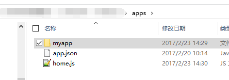  
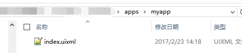   

Index.uixml页面基本格式如下:  

```html
<page>
    <script>
        <![CDATA[

        ]] >
    </script>
    <style>

    </style>
    <ui>

    </ui>
</page>
```  
其中&lt;page&gt;是uixml页面格式的根节点，没有实际意义。&lt;script&gt;里面写js，&lt;style&gt;里面可以写css，&lt;ui&gt;里面就是页面布局了。  

<h2 id="cid_2">页面布局</h2>

下面开始页面布局，sprite平台中布局容器叫做box，大部分布局效果都用box完成。  

首先在<ui>标签里面放一个box，让box宽高都等于手机屏幕。  

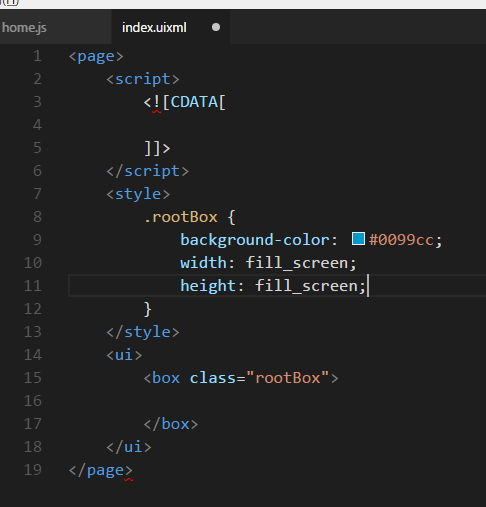 

然后在box里面用<text>控件写上文字，并调整下样式让其居中。  

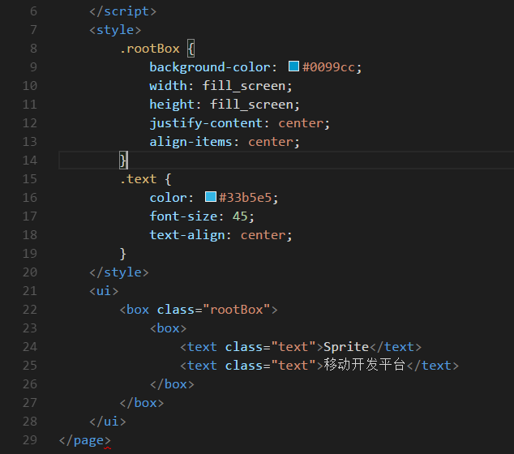 

这个时候，可以用手机查看效果，注意：mbuilder保存会同步代码。如果没有看到效果，尝试多关闭几次页面。  

手机效果如下图：  

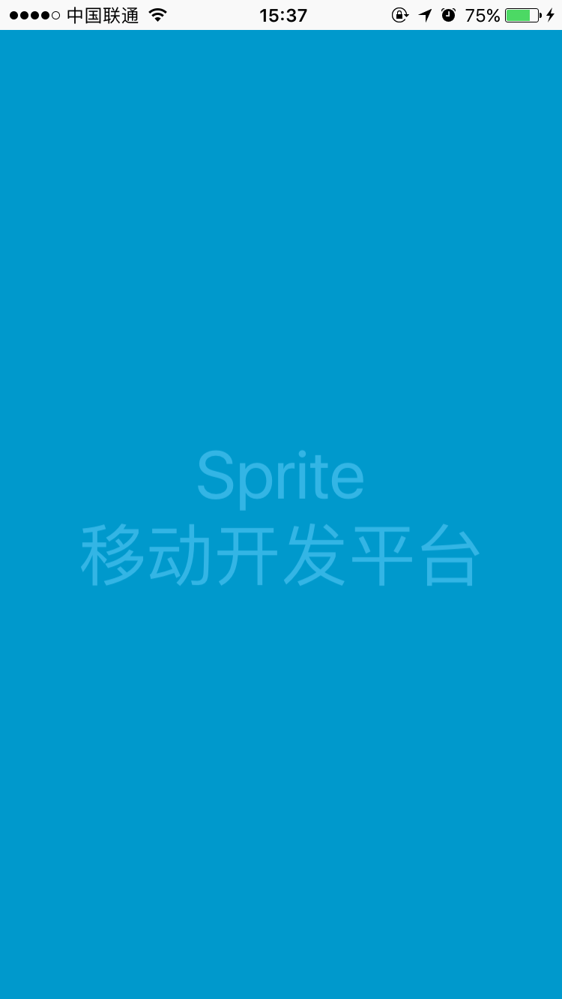  

为了代码编写规范，我们可以把css样式提出去，放到css文件里面引用。

mapp/css/myapp.css文件内容如下：

```css
.rootBox {
    background-color: #0099cc;
    width: fill_screen;
    height: fill_screen;
    justify-content: center;
    align-items: center;
}

text {
    color: #33b5e5;
    font-size: 45;
    text-align: center;
}

.textclose {
    font-size: 20;
    margin: 50 0 0 0;
}
```
在程序入口处我们已经配置过css路径，那么index.uixml中引用如下：

```
<style>
        @import url("myappcss");
</style>
```


<h2 id="cid_3">实现一个动画</h2>

动画需要靠js来实现，编写js同样放在js文件中引用：myapp/js/myapp.js

下面我们实现一个动画，让文字从小变大并且旋转起来。js代码如下：  

```html

(function () {
    var window = require("Window");
    var document = require("Document");
    var app = require("App");
    var textBox;
    window.on("loaded", function (e) {
        var textclose = document.getElement("textclose");
        //文本区域
        textBox = document.getElement("textBox");
        //初始的时候先隐藏
        textBox.setStyle("visibility", "hidden");
        textclose.on("click", function (e) {
            app.exitNoAsk();
        });
    });

    window.on("animator", function () {
        //启动动画
        startTextAnimation();
    });
    //文本区域动画
    function startTextAnimation() {
        //设置文本可见
        textBox.setStyle("visibility", "visible");

        var jsonData = {};
        jsonData.fillAfter = 1;
        var animationSet = new Array();
        //缩放动画
        var scaleAni = {};
        scaleAni.type = "scale";
        scaleAni.duration = 1500;
        scaleAni.curve = "linear";
        scaleAni.scaleFromX = 0.1;
        scaleAni.scaleToX = 1;
        scaleAni.scaleFromY = 0.1;
        scaleAni.scaleToY = 1;
        animationSet.push(scaleAni);
        //旋转动画
        var rotateAni = {};
        rotateAni.type = "rotate";
        rotateAni.duration = 1500;
        rotateAni.curve = "linear";
        rotateAni.fromDegree = 0;
        rotateAni.toDegree = 360;
        animationSet.push(rotateAni);
        jsonData.animationSet = animationSet;
        //启动动画
        textBox.startAnimation(jsonData, function () {
        });
    }
})();
```

index.uixml代码如下：

```
<page>
    <script>
        <![CDATA[
       var myappjs = require("myappjs"); 
        ]]>
    </script>
    <style>
        @import url("myappcss");
    </style>
    <ui>
        <box class="rootBox">
            <box id="textBox">
                <text class="text">Sprite</text>
                <text class="text">移动开发平台</text>
                <text class="textclose" id="textclose">点我关闭</text>
            </box>
           
        </box>
    </ui>
</page>

```

效果如下：  

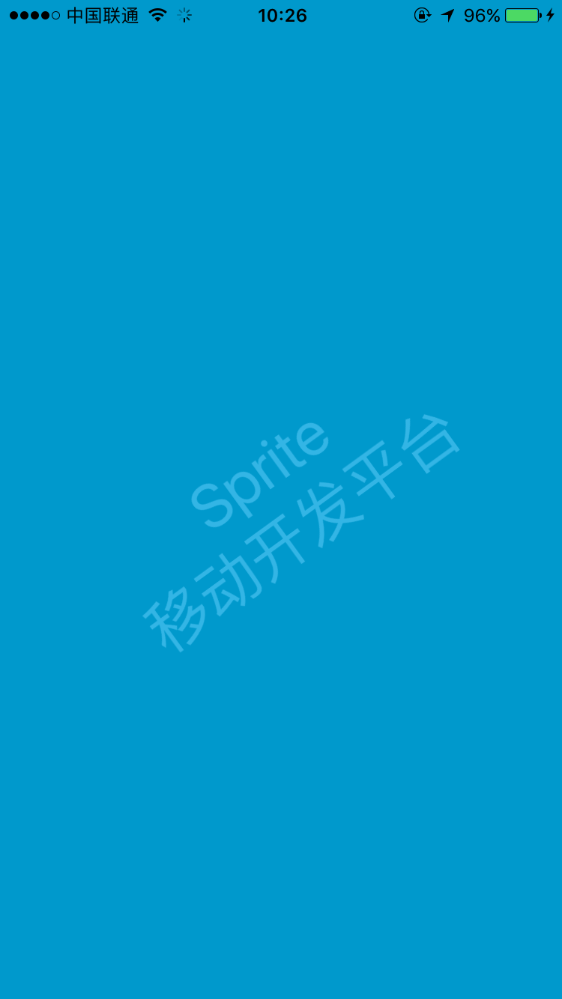  

接下来，我们在来做一个定时关闭页面的功能，在页面右上方放一个text用来显示倒计时。  

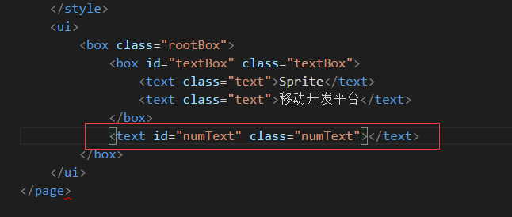    

然后给定样式，让其固定在页面右上方。  

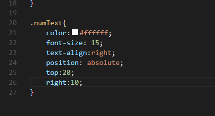   

通过控件id获取到控件对象。  

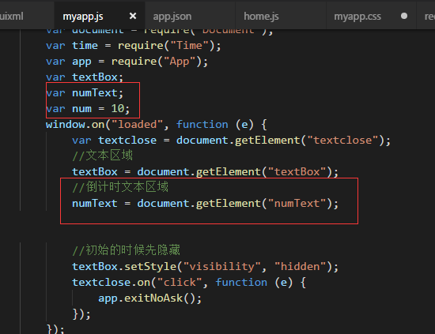    

最后在动画结束的回调里面做一个定时器，注意用定时器需要在js导入var Time = require("Time");  

 

编写定时器代码：

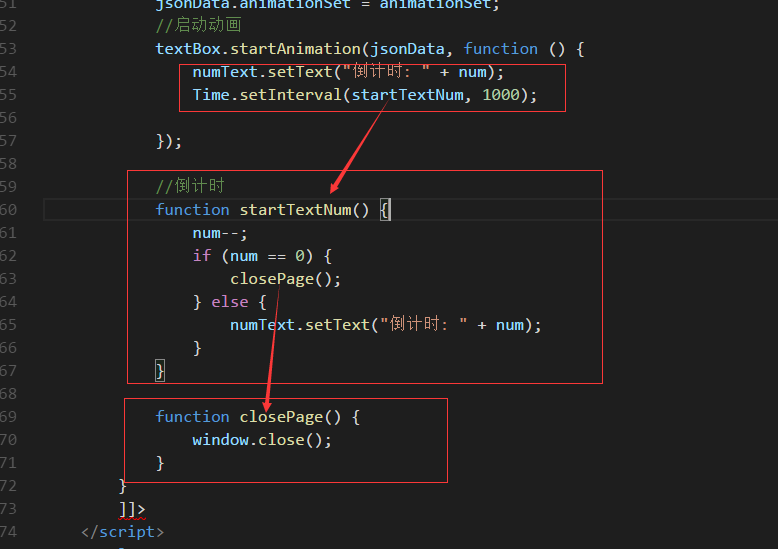   


最终效果如下：

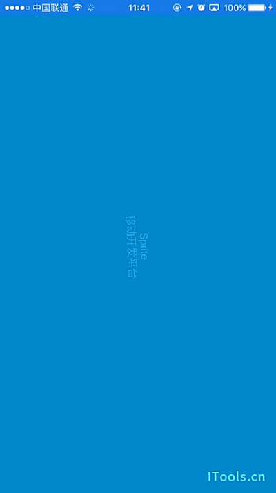 

