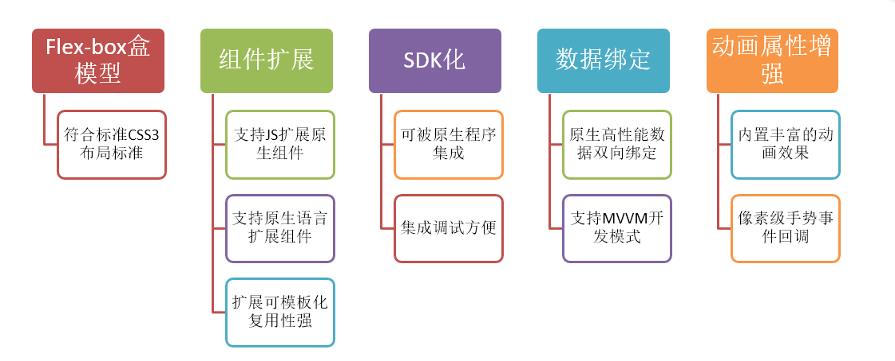
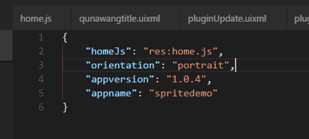
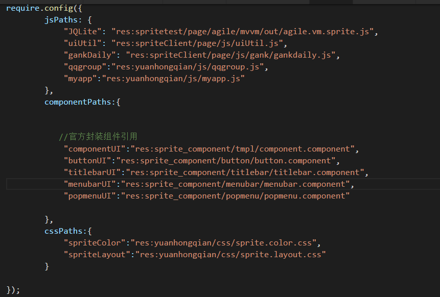
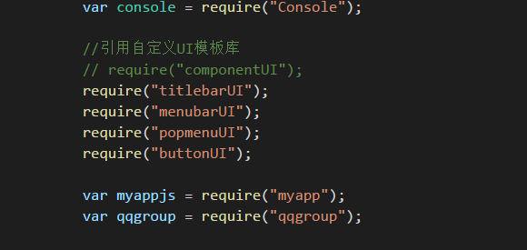
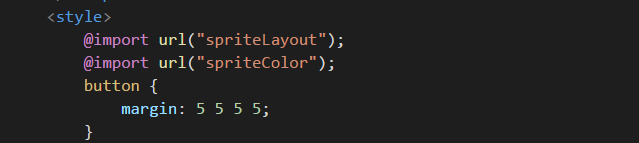

<h1>平台功能简介</h1>

----------

## 平台架构  

Sprite支持iOS和Android平台，iOS支持8.0及以上系统，Android支持4.5及以上系统。  

开发语言：领域专用语言（domain specific language / DSL），自有原生UI体系,xml + css + js开发模式。  

布局模型：Flex-box弹性盒子模型，是CSS3中的一种新的布局模式，是可以自动调整子元素的高和宽。  

Sprite特点如下：

   

##  应用程序入口  

Sprite的应用入口配置文件是app.json，该文件必须放在apps根目录下。  

    

homeJs:应用的入口js地址，res:前缀是基于apps目录开始；  

orientation:横竖屏设置，portrait:竖屏（默认）、landscape:横屏、device:支持横竖屏切换；  

syncip:设置同步小工具所在开发电脑的IP地址，一般情况就是自己电脑的ip地址。
syncname：设置同步小工具服务器名称，随便定义。  

在home.js里面主要配置一些全局的js、css和模板的路径，也可以定义一些全局的监听事件。当然最主要的还是配置应用启动类型。代码示例如下：  

```javascript
require.config({
        jsPaths: {
        },
        componentPaths:{
        },
        cssPaths:{
        }
});
var app = require("App");
var window = require("Window");
app.on("launch",function(e,jsonData){
    var type = jsonData.type;
     if(type =="normal"){
        //正常桌面启动
        var json = {};
        json.url = "res:myapp/index.uixml";
        window.open(json);
     }
     else if(type =="app"){
        //其他应用调用启动
     } 
     else if(type =="notification"){
        //推送消息启动
     } 
     else if(type =="localNotification"){
        //本地通知启动
     }
 });

```

通过监听app对象的launch事件，可以判断是哪种类型启动的应用，从而我们可以在应用启动的时候就做一些逻辑判断。该事件第二个参数jsonData里面有两个key属性：  

jsonData.type:启动类型和jsondData.data:启动得到的参数。  

启动类型主要有：  

normal：正常从桌面点击进入，大部分情况应该都是这种。  

app：第三方app调起sprite会进入，一般情况下可以在这个逻辑判断，通过jsondData.data可以得到第三方应用传过来的参数，关于data里面具体的参数由第三方app确定。  

notification：当客户端接收到push消息后，用户点击状态栏的push消息可进入这个逻辑判断。  

localNotification：当客户端本地收到通知消息的时候，用户点击状态消息可以进入这个逻辑，比如闹铃就是本地消息。  

在入口文件还可以通过app对象监听其他事件，比如横竖屏切换，这个地方的监听是全局，还可以监听自定义事件，开发者在后面的任何页面通过fire来触发事件。  

另外有一些全局的配置信息也可以在入口文件配置中，比如js、css和component组件模板文件路径。配置以后在具体uixml里面就可以直接通过标识引用。注意：require.config需放置于JS顶部。

如下图：  

  


在uixml里面就可以这样引用：  

Js和组件模板的引用 ，如图：

  

css样式文件的引用，如图：

    


##  UI组件简介

###  页面结构  

Sprite的页面布局文件扩展名是uixml，其本质上就是官方定义的xml格式文件，其页面结构由四个基本标签组成。  

&lt;page&gt;：定义页面根节点，必选项，无实际意思，目的是为了保证xml的完整性。  

&lt;script&gt;： 使用JavaScript描述页面中的数据和页面的行为，Sprite数据定义也在&lt;script>中进行，需要以&lt;![CDATA[  ]]&gt;包裹，代码遵循 JavaScript(ES5)语法，可选项。  

&lt;style&gt;：使用类CSS的语法描述页面的具体展现形式，可选项。  

&lt;ui&gt;：页面的布局元素全部放在该节点内部，使用类HTML的语法描述页面，内容由多个标签组成，不同的标签代表不同的组件，必选项。  

###   布局UI组件  

Sprite平台提供了一些基础的布局元素组件，如box、list、grid等通过这些基础布局标签开发者通过组合和css样式控制，可以实现丰富的页面布局效果，开发者还可以利用这些基础组件进行组件封装，比如封装成button、select这样的组件。  

Sprite中的组件依赖于sprite客户端的解析引擎才能够识别，解析引擎会把uixml格式标签直接转换为原生view，从而给使用者一种原生app的使用体验。除了使用sprite自身组件外，还可以在webview中使用标准的html5页面元素进行页面布局。从而实现一个页面窗口多种混合布局的效果。  

关于sprite的基础标签API说明，可以参考《Sprite详细设计文档》，本教程后面章节也会对每个组件具体使用做讲解。  

##  功能组件简介（js接口）  

Sprite平台除了提供了布局UI组件，还提供了一非常丰富了JSAPI功能组件，通过JSAPI功能组件开发者可以非常方便了调用本地能力，比如定位、电话、拍照、短信、本地数据库、网络请求等。其中网络请求能力是原生的网络请求，不会出现html的ajax的跨域问题。  

另外在功能组件里面还集成了非常丰富的第三方sdk，比如QQ、微信、微博第三方软件的登陆和分享，另外还有支付宝、微信支付等一些第三方支付平台的sdk。  

如果开发者想自己扩展功能，sprite还可以作为sdk提供开发者进行功能扩展。 

##  CSS语法规范   

Sprite中css全部是官方定义的，可能部分写法和标准css3类似，开发者不能全部照搬css3的样式规范，可以视为css3的一个子集。具体那个控件支持什么样式还是要查看《sprite详细设计文档》中具体标签的样式定义。  

开发者如果自己封装组件，也可以自己定义样式key的名称，最终在自己封装的组件里面做解析即可。  

同一个控件可以同时被多个样式作用，控件的class属性如果有多个样式，需要用空格分隔。  

注：sprite样式不支持样式继承，另外只支持类型选择器、ID选择器和类选择器3种形式。其他形式选择器一律不支持。比如div p{}、div,p{}、div>p{}这种类型的都不支持。  


### 选择器  

目前sprite中支持类型选择器、ID选择器和类选择器3种形式。  

>类型选择器：  

语法：E { sRules }  

说明：以UI组件类型(Type Selector)作为UI对象选择符。  

示例如下：  

```html

<style>
button {
	font-size: 20dp;
	color:#333333;
}
text {
	font-size: 15dp;
	color:#ffff00;
}
</style>  
```  

>ID选择器  

语法： #myid { sRules }  

说明：以唯一标识符id属性作为UI对象选择符  

示例：

```html
<style>
#submit {
	font-size: 20dp;
	color:#333333;
}
</style>
  
``` 

>类选择器  

类选择器一般用的是比较多的一种写法。  

语法： .myclass { sRules }  

说明：以class属性作为UI对象选择符，类选择符可以同时定义多个,以空格分隔  

示例：  

```html
.a {
	color: #ff0000;
}
.b {
	font-weight: bold;
}
<text class="a b">给某个div元素定义.a和.b两个类</text>
```   

###  CSS外部导入  

> 路径说明  

css样式和css文件导入都必须写在&lt;style&gt;标签里面，sprite中支持3种外部路径的写法来引入css样式文件，格式为：@import  url("CSS路径")。  
注：路径必须是本地路径，不支持网络的css路径。  

绝对路径：res:开头的都是基于apps的具体对路径；  

相对路径：如果在uixml里面引入就写基于uixml页面的相对路径，如果在模板文件里面引入，相对路径就是具有模板文件的；  

路径标识：在入口文件的require.config中的cssPaths节点配置css文件的标识，引入时直接写标识即可；     

> 优先级  

Sprite处理逻辑为：@import  url("xxx")不是绝对路径，则进行require.config里配置的标识匹配，若无法匹配则再进行相对路径处理。  

##  js语法规范    

Sprite平台中，js遵循 JavaScript(ES5)语法规范，基于ES5标准的js函数都可以使用，例如Date和Math对象里面的函数，不过由于平台的差异性android和ios采用的javascript引擎并不一样，Android采用google v8引擎，jni桥接，iOS使用系统Javascript core，可能在某些特殊的函数上有细微的差别，比如Math里面关于三角形勾股定理的函数ios有，android就没有，这个开发者如果遇到需要留意下。  

在sprite页面中js代码必须写在.uixml文件中&lt;script&gt;中，如果需要封装函数，javascript代码可作为函数模块，这样可在不同项目或页面中方便使用。  

Sprite采用CommonJS规范，JS模块中通过module.exports实现函数声明，通过require("模块标识")来加载外部JS模块。  

> 定义js函数  

JS模块文件后缀为.js, JS模块中通过module.exports实现函数声明，示例如下：  

示例：文件名 calculate.js。  

```javascript
//函数定义，形式一：
function  sumValue(t1,t2){
	return t1+t2 ;
}
//函数声明
module.exports.sum = sumValue;
```

```javascript
//函数定义，形式二：
module.exports.sum = function(t1,t2){
 return t1+t2 ;
};
```

```javascript
//函数定义，形式三：
module.exports = {
  sum:function(t1,t2){
        return t1+t2 ;
   }
};
```  

> 使用js函数    

通过require("js模块标识|js文件绝对路由|js文件相对路径")来加载外部JS模块，只支持加载本地js文件，传入模块标识为js文件路径，支持绝对路径及相对路径。  

示例：文件名test.uixml。  

根据模块标识引用：  

```javascript 
//在home.js文件里面配置相关require
require.config({
	jsPaths: {
		"sumjs": "res: testSprite/js/calculate.js "
	}
});


```

```javascript 
//页面中使用
var calculate  = require(“sumjs”);
var  result = calculate.sum(8,12);

```

根据绝对路径引用：  

```javascript 
//页面中使用
var calculate  = require(“res: testSprite/js/calculate.js”);
var  result = calculate.sum(8,12);
```

根据相对路径引用，加入test.uixml目录在testSprite/page/test.uixml，calculate.js 的目录为testSprite/js/calculate.js  

```javascript 

//页面中使用
var calculate  = require(“../js/calculate.js”);
var  result = calculate.sum(8,12);

```

> 优先级：  

Sprite处理逻辑为：若require("xx")不是绝对路径，则进行require.config里配置的标识匹配，若无法匹配则再进行相对路径处理。