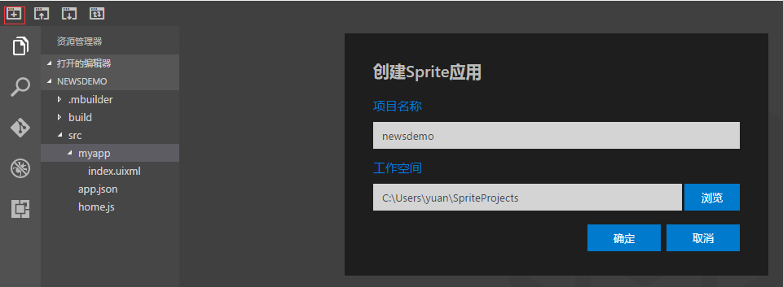
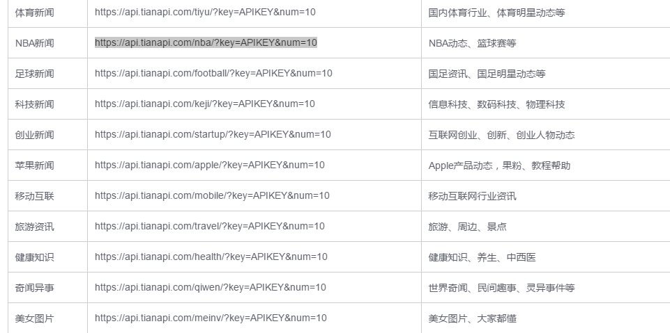
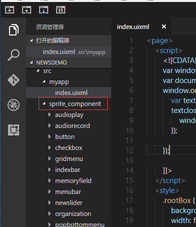

# 完成一个sprite应用

----------

**示例代码下载：** [newsdemo.sprite](https://www.exmobi.cn/downloadRedirect.jsp?type=sprite_template_newsdemo)  

xx.sprite文件是sprite工程文件，可以直接通过mbuilder5的导入sprite应用，导入该工程文件，如果只是想看源码开发者可以通过zip解压该文件，源码在src目录。 


在进行本节示例开发之前，强烈建议开发者先了解以下几章内容：

> [Flex布局原理](https://gitdocument.exmobi.cn/sprite-api/flexbjyl.html)
> 
> [公共样式](https://gitdocument.exmobi.cn/sprite-api/ggys.html)
> 
> [公共事件](https://gitdocument.exmobi.cn/sprite-api/ggsj.html)  
> 
> [公共方法](https://gitdocument.exmobi.cn/sprite-api/ggff.html)
> 
> [Window页面操作类](https://gitdocument.exmobi.cn/sprite-api/window.html)
> 
> [Document页面Dom操作类](https://gitdocument.exmobi.cn/sprite-api/document.html)


本节主要通过一个示例讲解Sprite应用开发过程细节，以及使用中的一些注意事项，本章节应用的数据来源以  天行数据网提供的 社会新闻接口为数据源。[http://www.tianapi.com/#news](http://www.tianapi.com/#news)，开发者学习过程中可自行注册一个账号，避免接口有试用次数限制。

<h2 id="cid_0">新建工程项目</h2>

打开mbuilder5，新建一个Sprite应用 



需要访问的接口数据来源：



接口中用到的key值，开发者自行申请。

该示例可能会用到一些Sprite封装组件，可以从“[Sprite官方UI组件](https://github.com/yuanhongqian/sprite-official-ui/tree/master/src)”获取，然后把sprite_component目录放在自己应用目录下，如图：



在app.json入口文件地方，require属性里面配置res:require.json，代码如下： 

```javascript
{
    "homeJs": "res:home.js",
    "orientation": "portrait",
    "require": "res:require.json",
    "appname": "newsdemo",
    "appversion": "1.0.0"
}
```

对应require.json代码如下：

```javascript
{
    "jsPaths": {},
    "componentPaths": {
        "buttonUI": "res:sprite_component/button/button.component",
        "titlebarUI": "res:sprite_component/titlebar/titlebar.component",
        "tabbarUI": "res:sprite_component/tabbar/tabbar.component",
        "list_news": "res:myapp/list_news.component"
    },
    "cssPaths": {}
}
```


<h2 id="cid_0">列表展示</h2>

工程创建好后，下面就可以编写列表布局页面myapp/list_news.uixml。

现在myapp/list_news.uixml变成我们的应用第一个界面，修改下home.js的应用启动代码，并且修改下打开页面的状态栏为透明。


**第一步，编写基本布局：**

根据接口可以返回来的数据内容，编写列表页面，代码如下：

```html
<page>
      <script>
            <![CDATA[
        var window = require("Window");
            var document = require("Document");
            require("titlebarUI");
            require("tabbarUI");

            //设置系统状态栏前景色为白色
            window.setStatusBarMode("light");
            window.on("loaded", function (e) {
                  var titlebarid = document.getElement("titlebarid");
                  var tabbarid = document.getElement("tabbarid");
                  titlebarid.on("ltextClick", function (e) {
                        window.close();
                  });

                  var json = {
                        datas: [
                              { "text": "娱乐" },
                              { "text": "体育" },
                              { "text": "NBA" },
                              { "text": "足球" },
                              { "text": "科技" },
                              { "text": "创业" },
                              { "text": "苹果" }
                        ]
                  };
                  tabbarid.loadData(json);
            });
        
        ]]>
      </script>
      <style>
            .rootBox {
                  background-color: #e5e5e5;
                  width: fill_screen;
                  height: fill_screen;
            }
            
            titlebar {
                  background-color: #549FF7;
                  title-color: #ffffff;
                  left-color: #ffffff;
                  height: 66;
                  padding: 20 0 0 0;
            }
            
            tabbar {
                  background-color: #ffffff
            }
            
            .newlist {
                  flex-direction: row;
                  justify-content: center;
                  align-items: center;
                  padding: 0 6 0 6;
                  background-color: #ffffff;
            }
            
            .newlist-cell-texttbox {
                  height: 75;
                  flex: 1;
                  flex-direction: column;
                  margin: 0 8 0 8;
            }
            
            .list-cell-text {
                  text-align: left;
                  font-size: 17;
                  color: #000000;
            }
            
            .newlist-cell-bottom {
                  flex-wrap: nowrap;
                  flex-direction: row;
                  align-items: center;
            }
            
            .newlist-cell-apply-box {
                  justify-content: center;
                  align-items: center;
                  background-color: #ececec;
                  border-radius: 8;
                  padding: 0;
            }
            
            .newlist-cell-type {
                  text-align: left;
                  singleline: true;
                  font-size: 13;
                  color: #a8a8a8;
            }
            
            .newlist-cell-image {
                  width: 100;
                  height: 75;
                  margin: 8 6 8 6;
                  scaleType: cover;
                  cacheType: memory;
                  fade: true;
            }
            
            .newlist-cell-apply-text {
                  text-align: right;
                  singleline: true;
                  font-size: 12;
                  color: #909090;
                  margin: 1 4 1 4;
            }
            
            .flex1 {
                  flex: 1;
            }
      </style>
      <ui>
            <box class="rootBox">
                  <titlebar id="titlebarid" ltext="返回" title="新闻列表" />
                  <tabbar id="tabbarid" bindid="sliderid" />
                  <slider style="flex:1" id="sliderid">
                        <box>
                              <box class="newlist  bg-white" style="">
                                    <image src="https://inews.gtimg.com/newsapp_ls/0/1371600988_150120/0?0.3978508608415723" defaultSrc="spritetest/page/yuanhongqian/image/wangyi/default_null_src.png"
                                          class="newlist-cell-image" />
                                    <box class="newlist-cell-texttbox" style="">
                                          <text class="list-cell-text">周立波延迟至少6月审 喊话： 多宣传我捐款的事</text>
                                          <box class="flex1"></box>
                                          <box class="newlist-cell-bottom">
                                                <text class="newlist-cell-type">腾讯明星</text>
                                                <box class="flex1" />
                                                <box class="newlist-cell-apply-box">
                                                      <text class="newlist-cell-apply-text">2017-04-08 06:45</text>
                                                </box>
                                          </box>
                                    </box>
                              </box>

                        </box>
                        <box>
                              <text>第2页</text>
                        </box>
                        <box>
                              <text>第3页</text>
                        </box>
                        <box>
                              <text>第4页</text>
                        </box>
                        <box>
                              <text>第5页</text>
                        </box>
                        <box>
                              <text>第6页</text>
                        </box>
                        <box>
                              <text>第7页</text>
                        </box>

                  </slider>

            </box>
      </ui>
</page>
```
上述示例先编写了页面大体结构，里面用了官方封装组件titlebar和tabbar，具体是使用说明可以参考[《Sprite官方UI组件》](https://gitdocument.exmobi.cn/sprite-official-ui/index.html)  

在代码中还用到了[window类 ](https://gitdocument.exmobi.cn/sprite-api/window.html)和 [document类](https://gitdocument.exmobi.cn/sprite-api/document.html)，对控件的操作要全部放在window的loaded事件之后，否者页面在布局过程中是得不到控件对象的。

控件对象的引用直接var xxx = require("xxx")即可。


上述代码只做了列表的一个模块，后面会把这个模块放在list里面做展示，代码效果如图：


**第二步，编写ajax请求**

接着，要开始编写列表请求的ajax，因为需要页面在已加载的时候执行，所以ajax方法放在loaded事件中，关于ajax的使用可以参考“[http 网络连接类](https://gitdocument.exmobi.cn/sprite-api/http.html)” 关键代码如下：  

在前面需要引用Http类 和 Console类：

```javascript
 var http = require("Http");
 var console = require("Console");
```

```javascript
var pagenum = 1;
var apikey = "da09fb5379a09ea4269ffadbd7cf29fd";
window.on("loaded", function (e) {
      var titlebarid = document.getElement("titlebarid");
      var tabbarid = document.getElement("tabbarid");
      titlebarid.on("ltextClick", function (e) {
            window.close();
      });
      var json = {
            datas: [
                  { "text": "娱乐" },
                  { "text": "体育" },
                  { "text": "NBA" },
                  { "text": "足球" },
                  { "text": "科技" },
                  { "text": "创业" },
                  { "text": "苹果" }
            ]
      };
      tabbarid.loadData(json);
      getListData(pagenum);
});

function getListData() {
      var option = {};
      option.url = "https://api.tianapi.com/huabian/?key=" + apikey + "&num=10&page=" + pagenum;
      option.method = "GET";
      option.data = "";
      option.reqCharset = "utf-8";
      option.isBlock = false;
      http.ajax(option, function (json) {
            if (json.status == 200) {
                  //成功
                  console.log(json.data);
            }
      });
}
```

**第三步，填充列表：**

请求到数据后就要用数据来填充列表，列表的展示，我们需要用到 [list列表组件](https://gitdocument.exmobi.cn/sprite-api/list.html) 和 [ListAdpter列表适配器组件](https://gitdocument.exmobi.cn/sprite-api/ListAdapter.html) ，实现后代码如下：

```html
<page>
      <script>
            <![CDATA[
            var window = require("Window");
            var document = require("Document");
            var listadapter = require("ListAdapter");
            var console = require("Console");
            var ui = require("UI");
            var http = require("Http");
            require("titlebarUI");
            require("tabbarUI");

            //设置系统状态栏前景色为白色
            window.setStatusBarMode("light");
            var pagenum = 1;//用于控制分页
            var apikey = "da09fb5379a09ea4269ffadbd7cf29fd";

            var list = null;//定义列表控件dom对象
            var datas = new Array();//定义列表数据数组
            var adapter = null;//定义适配器

            window.on("loaded", function (e) {
                  var titlebarid = document.getElement("titlebarid");
                  var tabbarid = document.getElement("tabbarid");
                  var sliderid = document.getElement("sliderid");
                  list = document.getElement("list");
                  titlebarid.on("ltextClick", function (e) {
                        window.close();
                  });


                  var json = {
                        datas: [
                              { "text": "娱乐", "url": "https://api.tianapi.com/huabian/?key=" + apikey + "&num=10" },
                              { "text": "体育", "url": "https://api.tianapi.com/tiyu/?key=" + apikey + "&num=10" },
                              { "text": "NBA", "url": "https://api.tianapi.com/nba/?key=" + apikey + "&num=10" },
                              { "text": "足球", "url": "https://api.tianapi.com/football/?key=" + apikey + "&num=10" },
                              { "text": "科技", "url": "https://api.tianapi.com/keji/?key=" + apikey + "&num=10" },
                              { "text": "创业", "url": "https://api.tianapi.com/startup/?key=" + apikey + "&num=10" },
                              { "text": "苹果", "url": "https://api.tianapi.com/apple/?key=" + apikey + "&num=10" }
                        ]
                  };
                  //监听slider切换，发起对应的ajax请求
                  sliderid.on("pageSelected", function (e, position) {
                        //该方法在document.refresh()后 ，第一次不生效，tabbarid1.loadData含有document.refresh()，所以放在之前执行。        
                        var url = json.datas[position].url;
                        getListData(pagenum, url);
                  });
                  tabbarid.loadData(json);
                  initAdapter();
            });

            function getListData(pagenum, url) {

                  var option = {};
                  option.url = url + "&page=" + pagenum;
                  option.method = "GET";
                  option.data = "";
                  option.reqCharset = "utf-8";
                  option.isBlock = false;
                  http.ajax(option, function (json) {

                        if (json.status == 200) {
                              //成功
                              console.log(JSON.parse(json.data));
                              var json = JSON.parse(json.data); //转json对象
                              if (json.code == 200) {
                                    //请求接口数据是对的,这里对数据做下操作，变成可用的注入数据
                                    datas = json.newslist;
                                    //刷新适配器，进行数据和布局绑定
                                    adapter.refresh();
                              }
                              else {
                                    //可能由于参数问题，接口返回错误数据
                                    mytoast(json.msg);
                              }
                        }
                        else {
                              mytoast("请求失败");
                        }
                  });
            }

            function initAdapter() {
                  if (adapter == null) {
                        adapter = new listadapter();
                        adapter.on("getCellId", function (e, position) {
                              //这里只有一种列表模板，直接返回cell的id
                              return "cell";
                        });
                        adapter.on("getSectionText", function (e, sectionindex) {
                              return null;
                        });
                        adapter.on("getSectionCount", function (e) {
                              return 1;
                        });

                        adapter.on("getView", function (e, position) {
                              //获取到每条数据，然后开始适配
                              var data = datas[position];
                              //得到每个列表子项里面的控件对象
                              var boxcell = e.target.getElement("boxcell");
                              var imgcell = e.target.getElement("imgcell");
                              var titlecell = e.target.getElement("titlecell");
                              var sectioncell = e.target.getElement("sectioncell");
                              var timecell = e.target.getElement("timecell");

                              //用数据进行赋值
                              imgcell.setAttr("src", data.picUrl);
                              titlecell.setText(data.title);
                              sectioncell.setText(data.description);
                              timecell.setText(data.ctime);


                              //设置列表点击背景色
                              var boxObj = e.target;
                              var event = boxcell.getOn("touchUp");
                              if (event.length == 0) {
                                    boxcell.on("touchDown", function (e) {
                                          this.setStyle("background-color", "#F5F5F5");
                                    });
                                    boxcell.on("touchUp", function (e) {
                                          this.setStyle("background-color", "#ffffff");
                                    });
                                    boxcell.on("touchCancel", function (e) {
                                          this.setStyle("background-color", "#ffffff");
                                    });
                              }

                        });
                        adapter.on("getCount", function (e) {
                              return datas.length;
                        });
                        list.setAdapter(adapter);
                  }
            }

            function mytoast(content) {
                  var json = {};
                  json.content = content;
                  json.duration = 1;
                  ui.toast(json);
            }
        ]]>
      </script>
      <style>
            .rootBox {
                  background-color: #e5e5e5;
                  width: fill_screen;
                  height: fill_screen;
            }
            
            titlebar {
                  background-color: #549FF7;
                  title-color: #ffffff;
                  left-color: #ffffff;
                  height: 66;
                  padding: 20 0 0 0;
            }
            
            tabbar {
                  background-color: #ffffff
            }
            
            .newlist {
                  flex-direction: row;
                  justify-content: center;
                  align-items: center;
                  padding: 0 6 0 6;
                  background-color: #ffffff;
            }
            
            .newlist-cell-texttbox {
                  height: 75;
                  flex: 1;
                  flex-direction: column;
                  margin: 0 8 0 8;
            }
            
            .list-cell-text {
                  text-align: left;
                  font-size: 17;
                  color: #000000;
            }
            
            .newlist-cell-bottom {
                  flex-wrap: nowrap;
                  flex-direction: row;
                  align-items: center;
            }
            
            .newlist-cell-apply-box {
                  justify-content: center;
                  align-items: center;
                  background-color: #ececec;
                  border-radius: 8;
                  padding: 0;
            }
            
            .newlist-cell-type {
                  text-align: left;
                  singleline: true;
                  font-size: 13;
                  color: #a8a8a8;
            }
            
            .newlist-cell-image {
                  width: 100;
                  height: 75;
                  margin: 8 6 8 6;
                  scaleType: cover;
                  cacheType: memory;
                  fade: true;
            }
            
            .newlist-cell-apply-text {
                  text-align: right;
                  singleline: true;
                  font-size: 12;
                  color: #909090;
                  margin: 1 4 1 4;
            }
            
            .flex1 {
                  flex: 1;
            }
      </style>
      <ui>
            <box class="rootBox">
                  <titlebar id="titlebarid" ltext="返回" title="新闻列表" />
                  <tabbar id="tabbarid" bindid="sliderid" />
                  <slider style="flex:1" id="sliderid">
                        <box>
                              <list id="list" style="flex:1" scrollToTop="true">
                                    <cell id="cell">
                                          <box id="boxcell" class="newlist  bg-white" style="">
                                                <image id="imgcell" src="https://inews.gtimg.com/newsapp_ls/0/1371600988_150120/0?0.3978508608415723" defaultSrc="spritetest/page/yuanhongqian/image/wangyi/default_null_src.png"
                                                      class="newlist-cell-image" />
                                                <box class="newlist-cell-texttbox" style="">
                                                      <text class="list-cell-text" id="titlecell">周立波延迟至少6月审 喊话： 多宣传我捐款的事</text>
                                                      <box class="flex1"></box>
                                                      <box class="newlist-cell-bottom">
                                                            <text class="newlist-cell-type" id="sectioncell">腾讯明星</text>
                                                            <box class="flex1" />
                                                            <box class="newlist-cell-apply-box">
                                                                  <text class="newlist-cell-apply-text" id="timecell">2017-04-08 06:45</text>
                                                            </box>
                                                      </box>
                                                </box>
                                          </box>
                                          <box style="height: 8" />
                                    </cell>
                              </list>
                        </box>
                        <box>
                              <text>第2页</text>
                        </box>
                        <box>
                              <text>第3页</text>
                        </box>
                        <box>
                              <text>第4页</text>
                        </box>
                        <box>
                              <text>第5页</text>
                        </box>
                        <box>
                              <text>第6页</text>
                        </box>
                        <box>
                              <text>第7页</text>
                        </box>

                  </slider>
            </box>
      </ui>
</page>
```

上述代码把ajax请求放在了slider切换事件里面，为后续tabbar切换做准备，另外对注入tabbar控件的数据也做了修改，加了一个url属性，以便获取对应的url值。具体代码效果如图：


**第四步，下拉刷新和上拉翻页：**

在上述代码的list组件一头一尾加上[refresh刷新控件](https://gitdocument.exmobi.cn/sprite-api/refresh.html)，分别用于下拉刷新和上拉翻页操作，局部代码如下：

```html
 <list id="list" style="flex:1" scrollToTop="true">
    <refresh type="top" distance="60" id="top">
          <box style="height: 60; flex-direction: row; align-items: center;justify-content: center;">
                <image id="topimage" src="image/dragrefresh_down.png" style="height:30;width:30;margin: 8" />
                <text id="toptext" style="singleline:true;text-align:center;color:#909090">下拉可以刷新...</text>
          </box>
    </refresh>
    <cell id="cell">
          <box id="boxcell" class="newlist  bg-white" style="">
                <image id="imgcell" src="https://inews.gtimg.com/newsapp_ls/0/1371600988_150120/0?0.3978508608415723" class="newlist-cell-image"
                      defaultSrc="image/ic_pic_normal.png" />
                <box class="newlist-cell-texttbox" style="">
                      <text class="list-cell-text" id="titlecell">周立波延迟至少6月审 喊话： 多宣传我捐款的事</text>
                      <box class="flex1"></box>
                      <box class="newlist-cell-bottom">
                            <text class="newlist-cell-type" id="sectioncell">腾讯明星</text>
                            <box class="flex1" />
                            <box class="newlist-cell-apply-box">
                                  <text class="newlist-cell-apply-text" id="timecell">2017-04-08 06:45</text>
                            </box>
                      </box>
                </box>
          </box>
          <box style="height: 8" />
    </cell>
    <refresh type="bottom" distance="60" id="bottom">
          <box style="height: 60; flex-direction: row; align-items: center;justify-content: center;">
                <image id="bottomimage" src="image/dragrefresh_up.png" style="height:30;width:30;margin: 8" />
                <text id="bottomtext" style="singleline:true;text-align:center;color:#909090">上拉可以加载</text>
          </box>
    </refresh>
</list>
```
然后对刷新组件做事件监听，代码如下：

定义相关组件对象，在window的loaded事件里面

```javascript
var top = document.getElement("top");
var topimage = document.getElement("topimage");
var toptext = document.getElement("toptext");
var bottomimage = document.getElement("bottomimage");
var bottomtext = document.getElement("bottomtext");
```
在window的loaded事件里面，写监听事件：

```javascript
 //监听fresh拖动时间，会多次执行
top.on("drag", function (e, param) {
    console.log(param);
    if (param >= 0 && param < 60) {
          topimage.setAttr("src", "image/dragrefresh_down.png");
          toptext.setText("下拉可以刷新");
    }
    else {
          topimage.setAttr("src", "image/dragrefresh_up.png");
          toptext.setText("松开立即刷新");
    }

});

top.on("refresh", function (e) {
    topimage.setAttr("src", "image/loading.gif");
    toptext.setText("正在刷新数据...");
    tagrefresh = 0;
    pagenum = 1;
    //这里调用ajax进行刷新
    getListData(pagenum, json.datas[0].url, tagrefresh);
});

bottom.on("drag", function (e, param) {
    if (param >= 0 && param < 60) {
          bottomimage.setAttr("src", "image/dragrefresh_up.png");
          bottomtext.setText("上拉加载更多..");
    }
    else {
          bottomimage.setAttr("src", "image/dragrefresh_down.png");
          bottomtext.setText("松开立即刷新");
    }
});

bottom.on("refresh", function (e) {
    bottomimage.setAttr("src", "image/loading.gif");
    bottomtext.setText("正在加载数据...");
    tagrefresh = 1;
    pagenum = pagenum + 1;
    //这里调用ajax进行刷新
    getListData(pagenum, json.datas[0].url, tagrefresh);
});

});
```
由于为了判断是刷新还是加载，之前的getListData方法也需要改造，改造后代码如下：

```javascript
function getListData(pagenum, url, tagrefresh) {

      var option = {};
      option.url = url + "&page=" + pagenum;
      option.method = "GET";
      option.data = "";
      option.reqCharset = "utf-8";
      option.isBlock = false;
      http.ajax(option, function (json) {

            if (json.status == 200) {
                  //成功
                  var json = JSON.parse(json.data); //转json对象
                  if (json.code == 200) {
                        if (tagrefresh == 0) {
                              //请求接口数据是对的,这里对数据做下操作，变成可用的注入数据
                              datas = json.newslist;
                              //刷新适配器，进行数据和布局绑定
                              adapter.refresh();
                              top.reset();
                        }
                        else if (tagrefresh == 1) {
                              //把新请求的数组合并到原来的数组中
                              for (var i = 0; i < json.newslist.length; i++) {
                                    datas.push(json.newslist[i]);
                              }
                              adapter.refresh();
                              //复位底部刷新组件
                              bottom.reset();
                        }
                  }
                  else {
                        //可能由于参数问题，接口返回错误数据
                        mytoast(json.msg);
                  }
            }
            else {
                  mytoast("请求失败");
            }
      });
}
```

效果如图：


**第五步，完成其他tabbar子页面列表：**

如果只是一个页面列表，到前四步为止，我们基本已经完成，但是该示例有多个子页面列表，为了让代码可以复用，我们这里需要把它封装成模板，否者在一个页面里面写所有列表，代码量会太大，而且要定义多组list，关于组件的封装可以参考高级教程“[Sprite自定义组件开发](https://gitdocument.exmobi.cn/sprite-senior/component-development.html)”，不过这里我们只是封装成模板，不需要像封装组件那么复杂，也不需要考虑其通用性。

大家在实际开发过程中可以直接在一开始就考虑封装成模板，只是本示例为方便教学由简如深，才没有在设计的时候就封装模板。

在myapp目录新建一个list_news.component模板文件，然后在home.js入口文件的require.config里面的componentPaths下配置下模板路径：

```javascript
"list_news":"res:myapp/list_news.component"
```


封装成模板后，list_news.component文件代码如下：

```html
<page>
    <module>
        <![CDATA[
        require("titlebarUI"); 
        require("tabbarUI");
        ]]>
    </module>
    <script>
        <![CDATA[
        var window = require("Window");
        var document = require("Document");
        var listadapter = require("ListAdapter");
        var console = require("Console");
        var ui = require("UI");
        var http = require("Http");
        var ListNews = require("js/list_news.js");
        module.exports = ListNews;
        ]]>
    </script>
    <style>
        @import url("css/list_news.css");
    </style>
    <ui>
        <box>
            <list id="list" style="flex:1" scrollToTop="true">
                <refresh type="top" distance="60" id="top">
                    <box style="height: 60; flex-direction: row; align-items: center;justify-content: center;">
                        <image id="topimage" src="image/dragrefresh_down.png" style="height:30;width:30;margin: 8" />
                        <text id="toptext" style="singleline:true;text-align:center;color:#909090">下拉可以刷新...</text>
                    </box>
                </refresh>
                <cell id="cell">
                    <box id="boxcell" class="newlist  bg-white" style="">
                        <image id="imgcell" src="https://inews.gtimg.com/newsapp_ls/0/1371600988_150120/0?0.3978508608415723" class="newlist-cell-image"
                            defaultSrc="image/ic_pic_normal.png" />
                        <box class="newlist-cell-texttbox" style="">
                            <text class="list-cell-text" id="titlecell">周立波延迟至少6月审 喊话： 多宣传我捐款的事</text>
                            <box class="flex1"></box>
                            <box class="newlist-cell-bottom">
                                <text class="newlist-cell-type" id="sectioncell">腾讯明星</text>
                                <box class="flex1" />
                                <box class="newlist-cell-apply-box">
                                    <text class="newlist-cell-apply-text" id="timecell">2017-04-08 06:45</text>
                                </box>
                            </box>
                        </box>
                    </box>
                    <box style="height: 8" />
                </cell>
                <refresh type="bottom" distance="60" id="bottom">
                    <box style="height: 60; flex-direction: row; align-items: center;justify-content: center;">
                        <image id="bottomimage" src="image/dragrefresh_up.png" style="height:30;width:30;margin: 8" />
                        <text id="bottomtext" style="singleline:true;text-align:center;color:#909090">上拉可以加载</text>
                    </box>
                </refresh>
            </list>
        </box>
    </ui>
</page>
```
模板里面的核心js单独提出来形成一个文件js/list_news.js，代码如下：

```javascript
var ListNews = function () {
    this.pagenum = 1;//用于控制分页
    this.list = null;//定义列表控件dom对象
    this.datas = new Array();//定义列表数据数组
    this.adapter = null;//定义适配器
    this.top = null;//定义下拉刷新组件对象
    this.bottom = null;//定义下拉刷新组件对象
    this.url = null;
};

ListNews.prototype = {
    created: function () {
        var copythis = this;
        var titlebarid = this.getElement("titlebarid");
        var tabbarid = this.getElement("tabbarid");
        var sliderid = this.getElement("sliderid");
        var topimage = this.getElement("topimage");
        var toptext = this.getElement("toptext");
        var bottomimage = this.getElement("bottomimage");
        var bottomtext = this.getElement("bottomtext");

        this.list = this.getElement("list");
        this.top = this.getElement("top");
        this.bottom = this.getElement("bottom");
        var tagrefresh = 0; //标识刷新方式，0标识刷新更新整个列表，1标识翻页数据累加

        this.initAdapter();

        //监听fresh拖动时间，会多次执行
        this.top.on("drag", function (e, param) {
            console.log(param);
            if (param >= 0 && param < 60) {
                topimage.setAttr("src", "image/dragrefresh_down.png");
                toptext.setText("下拉可以刷新");
            }
            else {
                topimage.setAttr("src", "image/dragrefresh_up.png");
                toptext.setText("松开立即刷新");
            }

        });

        this.top.on("refresh", function (e) {
            topimage.setAttr("src", "image/loading.gif");
            toptext.setText("正在刷新数据...");
            tagrefresh = 0;
            copythis.pagenum = 1;
            //这里调用ajax进行刷新
            copythis.getListData(copythis.pagenum, copythis.url, tagrefresh);
        });

        this.bottom.on("drag", function (e, param) {
            if (param >= 0 && param < 60) {
                bottomimage.setAttr("src", "image/dragrefresh_up.png");
                bottomtext.setText("上拉加载更多..");
            }
            else {
                bottomimage.setAttr("src", "image/dragrefresh_down.png");
                bottomtext.setText("松开立即刷新");
            }
        });

        this.bottom.on("refresh", function (e) {
            bottomimage.setAttr("src", "image/loading.gif");
            bottomtext.setText("正在加载数据...");
            tagrefresh = 1;
            copythis.pagenum = copythis.pagenum + 1;
            //这里调用ajax进行刷新
            copythis.getListData(copythis.pagenum, copythis.url, tagrefresh);
        });
    },
    getListData: function (pagenum, url, tagrefresh) {
        var copythis = this;
        this.url = url;
        var option = {};
        option.url = url + "&page=" + pagenum;
        option.method = "GET";
        option.data = "";
        option.reqCharset = "utf-8";
        option.isBlock = false;
        http.ajax(option, function (json) {

            if (json.status == 200) {
                //成功
                console.log("1111进来了加载。。。。。" + json.data);
                var json = JSON.parse(json.data); //转json对象
                if (json.code == 200) {
                    if (tagrefresh == 0) {
                        //请求接口数据是对的,这里对数据做下操作，变成可用的注入数据
                        copythis.datas = json.newslist;
                        //刷新适配器，进行数据和布局绑定
                        copythis.adapter.refresh();
                        copythis.top.reset();
                    }
                    else if (tagrefresh == 1) {
                        //把新请求的数组合并到原来的数组中
                        for (var i = 0; i < json.newslist.length; i++) {
                            copythis.datas.push(json.newslist[i]);
                        }
                        copythis.adapter.refresh();
                        //复位底部刷新组件
                        copythis.bottom.reset();
                    }
                }
                else {
                    //可能由于参数问题，接口返回错误数据
                    copythis.mytoast(json.msg);
                }
            }
            else {
                copythis.mytoast("请求失败");
            }
        });
    },
    initAdapter: function () {
        var copythis = this;
        if (this.adapter == null) {
            this.adapter = new listadapter();
            this.adapter.on("getCellId", function (e, position) {
                //这里只有一种列表模板，直接返回cell的id
                return "cell";
            });
            this.adapter.on("getSectionText", function (e, sectionindex) {
                return null;
            });
            this.adapter.on("getSectionCount", function (e) {
                return 1;
            });
            this.adapter.on("getView", function (e, position) {
                //获取到每条数据，然后开始适配
                var data = copythis.datas[position];
                //得到每个列表子项里面的控件对象
                var boxcell = e.target.getElement("boxcell");
                var imgcell = e.target.getElement("imgcell");
                var titlecell = e.target.getElement("titlecell");
                var sectioncell = e.target.getElement("sectioncell");
                var timecell = e.target.getElement("timecell");

                //用数据进行赋值
                if (data.picUrl == "") {
                    imgcell.setAttr("src", "image/ic_pic_normal.png");
                }
                else {
                    imgcell.setAttr("src", data.picUrl);
                }

                titlecell.setText(data.title);
                sectioncell.setText(data.description);
                timecell.setText(data.ctime);

                //设置列表点击背景色
                var boxObj = e.target;
                var event = boxcell.getOn("touchUp");
                if (event.length == 0) {
                    boxcell.on("touchDown", function (e) {
                        this.setStyle("background-color", "#F5F5F5");
                    });
                    boxcell.on("touchUp", function (e) {
                        this.setStyle("background-color", "#ffffff");
                    });
                    boxcell.on("touchCancel", function (e) {
                        this.setStyle("background-color", "#ffffff");
                    });
                }

            });
            this.adapter.on("getCount", function (e) {
                return copythis.datas.length;
            });
            this.list.setAdapter(this.adapter);
        }
    },
    init: function () { },
    mytoast: function (content) {
        var json = {};
        json.content = content;
        json.duration = 1;
        ui.toast(json);
    },
    //属性变更回调函数
    attrChanged: function (attrName, attrValue) { },
    //样式变更回调函数
    styleChanged: function (styleName, styleValue) { }
}

module.exports = ListNews;
```
模板中样式文件也单独提取出来形成一个css文件，css/list_news.css代码如下：
```css
.newlist {
    flex-direction: row;
    justify-content: center;
    align-items: center;
    padding: 0 6 0 6;
    background-color: #ffffff;
}

.newlist-cell-texttbox {
    height: 75;
    flex: 1;
    flex-direction: column;
    margin: 0 8 0 8;
}
 
.list-cell-text {
    text-align: left;
    font-size: 17;
    color: #000000;
}

.newlist-cell-bottom {
    flex-wrap: nowrap;
    flex-direction: row;
    align-items: center;
}

.newlist-cell-apply-box {
    justify-content: center;
    align-items: center;
    background-color: #ececec;
    border-radius: 8;
    padding: 0;
}

.newlist-cell-type {
    text-align: left;
    singleline: true;
    font-size: 13;
    color: #a8a8a8;
}

.newlist-cell-image {
    width: 100;
    height: 75;
    margin: 8 6 8 6;
    scaleType: cover;
    cacheType:memory;
    fade: true;
}

.newlist-cell-apply-text {
    text-align: right;
    singleline: true;
    font-size: 12;
    color: #909090;
    margin: 1 4 1 4;
}

.flex1 {
    flex: 1;
}
```

原来的列表页面list_news.uixml也需要做修改，修改后代码如下：

```html
<page>
      <script>
            <![CDATA[
            var window = require("Window");
            var document = require("Document");
            var listadapter = require("ListAdapter");
            var console = require("Console");
            var ui = require("UI");
            var http = require("Http");
            var time = require("Time");
            require("titlebarUI");
            require("tabbarUI");
            require("list_news");
            //设置系统状态栏前景色为白色
            window.setStatusBarMode("light");
            var pagenum = 1;//用于控制分页
            var apikey = "da09fb5379a09ea4269ffadbd7cf29fd";
            window.on("loaded", function (e) {
                  var titlebarid = document.getElement("titlebarid");
                  var tabbarid = document.getElement("tabbarid");
                  var sliderid = document.getElement("sliderid");
                  var list_arr = sliderid.getChildren();

                  var tagrefresh = 0; //标识刷新方式，0标识刷新更新整个列表，1标识翻页数据累加
                  titlebarid.on("ltextClick", function (e) {
                        window.close();
                  });

                  var json = {
                        datas: [
                              { "text": "娱乐", "url": "https://api.tianapi.com/huabian/?key=" + apikey + "&num=10" },
                              { "text": "体育", "url": "https://api.tianapi.com/tiyu/?key=" + apikey + "&num=10" },
                              { "text": "NBA", "url": "https://api.tianapi.com/nba/?key=" + apikey + "&num=10" },
                              { "text": "足球", "url": "https://api.tianapi.com/football/?key=" + apikey + "&num=10" },
                              { "text": "科技", "url": "https://api.tianapi.com/keji/?key=" + apikey + "&num=10" },
                              { "text": "创业", "url": "https://api.tianapi.com/startup/?key=" + apikey + "&num=10" },
                              { "text": "苹果", "url": "https://api.tianapi.com/apple/?key=" + apikey + "&num=10" }
                        ]
                  };
                  //监听slider切换，发起对应的ajax请求
                  sliderid.on("pageSelected", function (e, position) {
                        if (list_arr[position].getAttr("reqtag") == "0") {
                              //该方法在document.refresh()后 ，第一次不生效，tabbarid1.loadData含有document.refresh()，所以放在之前执行。        
                              var url = json.datas[position].url;
                              list_arr[position].getListData("1", json.datas[position].url, "0");
                              //给每个列表加上一个标识属性，如果请求过，在切换的时候就不再请求了。
                              list_arr[position].setAttr("reqtag", "1");
                        }
                  });
                  tabbarid.loadData(json);
            });
     
        ]]>
      </script>
      <style>
            .rootBox {
                  background-color: #e5e5e5;
                  width: fill_screen;
                  height: fill_screen;
            }
            
            titlebar {
                  background-color: #549FF7;
                  title-color: #ffffff;
                  left-color: #ffffff;
                  height: 66;
                  padding: 20 0 0 0;
            }
            
            tabbar {
                  background-color: #ffffff
            }
            
            .flex1 {
                  flex: 1;
            }
      </style>
      <ui>
            <box class="rootBox">
                  <titlebar id="titlebarid" ltext="返回" title="新闻列表" />
                  <tabbar id="tabbarid" bindid="sliderid" />
                  <slider style="flex:1" id="sliderid">
                        <list_news id="list_1" reqtag="0" />
                        <list_news id="list_2" reqtag="0" />
                        <list_news id="list_3" reqtag="0" />
                        <list_news id="list_4" reqtag="0" />
                        <list_news id="list_5" reqtag="0" />
                        <list_news id="list_6" reqtag="0" />
                        <list_news id="list_7" reqtag="0" />
                  </slider>
            </box>
      </ui>
</page>
```
修改后的代码可以看出，结构非常清晰，主文件代码变得非常简化，后续只需要修改模板文件即可全部生效。

最终效果图如下：


<h2 id="cid_0">详情展示</h2>

由于这里详情都是新闻地址，如果做的简单点，就直接把新闻地址给webview进行显示即可。

**第一步，在列表的基础上添加监听列表的点击事件：**

直接在list_news.js的created里面做list监听，代码如下：

```javascript
 this.list.on("itemClick", function (e, position, sectionPostion) {
    var data = copythis.datas[position];
    var json = {};
    json.url = "res:myapp/detail_news.uixml";
    json.target = "_blank";
    json.id = "helloword";
    json.statusBarColor = "#f9f9f9";
    json.openAnimation = "push_r2l";
    json.closeAnimation = "push_l2r";
    json.statusBar = "transparent";
    json.data = {};
    json.data.url = data.url;
    window.open(json);
});
```

**第二步，创建myapp/detail_news.uixml文件**

在该页面中直接用webview进行网页显示，代码如下：  

```html
<page>
      <script>
            <![CDATA[
            var window = require("Window");
            var document = require("Document");
            var listadapter = require("ListAdapter");
            var console = require("Console");
            var ui = require("UI");
            var http = require("Http");
            var time = require("Time");
            require("titlebarUI");
            //设置系统状态栏前景色为白色
            window.setStatusBarMode("light");

            window.on("loaded", function (e) {
                  var titlebarid = document.getElement("titlebarid");
                  var webviewid = document.getElement("webviewid");
                  titlebarid.on("ltextClick", function (e) {
                        window.close();
                  });

                  var getdata = window.getData();
                  var url = getdata.url;
                  webviewid.setAttr("url", url);
            });
     
        ]]>
      </script>
      <style>
            .rootBox {
                  background-color: #e5e5e5;
                  width: fill_screen;
                  height: fill_screen;
            }        
            titlebar {
                  background-color: #549FF7;
                  title-color: #ffffff;
                  left-color: #ffffff;
                  height: 66;
                  padding: 20 0 0 0;
            }
            
            .flex1 {
                  flex: 1;
            }
      </style>
      <ui>
            <box class="rootBox">
                  <titlebar id="titlebarid" ltext="返回" title="新闻详情" />
                  <webview style="flex:1" id="webviewid" />
            </box>
      </ui>
</page>
```
效果图如下：


<h2 id="cid_0">应用打包</h2>

 敬请期待


